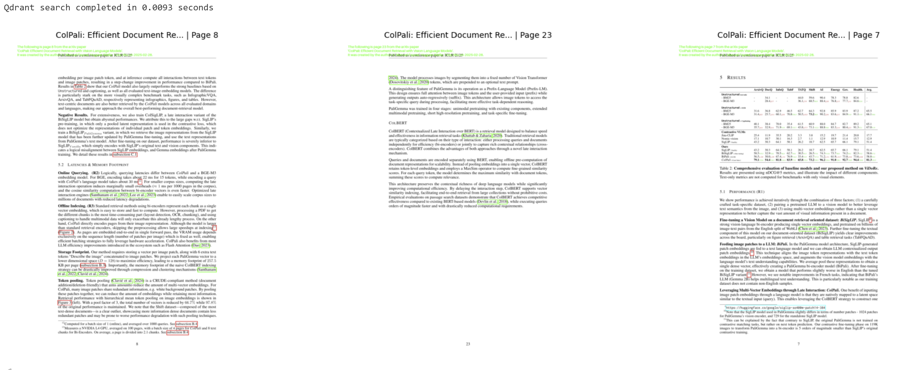
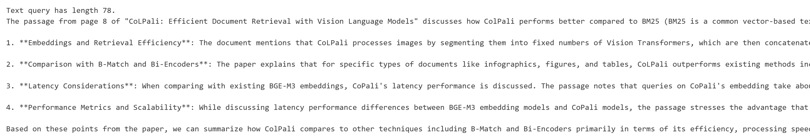

## Installation

This code has only been tested on Ubuntu/WSL. First install the following packages on linux:

```bash
$ sudo apt-get update
$ sudo apt-get install --quiet -y poppler-utils
```

Then create the and activate a conda environment using environment.yml, or run the following commands with pip:

```bash
$ pip install git+https://github.com/krishanr/zoterorag
$ pip install git+https://github.com/illuin-tech/colpali
```

Then follow the steps for getting a [zotero API key](https://pyzotero.readthedocs.io/en/latest/) and add it to your .env file under the variable ```ZOTERO_API_KEY```. Also add your ```HUGGINGFACE_ACCESS_TOKEN``` to your .env file.

Once the installation steps are complete, the demo can be run in the notebook zotero_rag.ipynb.

## Demo

Example data used for data ingestion:

```python
items = [{'version': 283,
  'library': {'type': 'user'},
  'meta': {'creatorSummary': 'Faysse et al.',
   'parsedDate': '2025-02-28',
   'numChildren': 3},
  'data': {'version': 283,
   'itemType': 'preprint',
   'title': 'ColPali: Efficient Document Retrieval with Vision Language Models',
   'creators': [{'creatorType': 'author',
     'firstName': 'Manuel',
     'lastName': 'Faysse'},
    {'creatorType': 'author', 'firstName': 'Hugues', 'lastName': 'Sibille'},
    {'creatorType': 'author', 'firstName': 'Tony', 'lastName': 'Wu'},
    {'creatorType': 'author', 'firstName': 'Bilel', 'lastName': 'Omrani'},
    {'creatorType': 'author', 'firstName': 'Gautier', 'lastName': 'Viaud'},
    {'creatorType': 'author', 'firstName': 'Céline', 'lastName': 'Hudelot'},
    {'creatorType': 'author', 'firstName': 'Pierre', 'lastName': 'Colombo'}],
   'abstractNote': 'Documents are visually rich structures that convey information through text, but also figures, page layouts, tables, or even fonts. Since modern retrieval systems mainly rely on the textual information they extract from document pages to index documents -often through lengthy and brittle processes-, they struggle to exploit key visual cues efficiently. This limits their capabilities in many practical document retrieval applications such as Retrieval Augmented Generation (RAG). To benchmark current systems on visually rich document retrieval, we introduce the Visual Document Retrieval Benchmark ViDoRe, composed of various page-level retrieval tasks spanning multiple domains, languages, and practical settings. The inherent complexity and performance shortcomings of modern systems motivate a new concept; doing document retrieval by directly embedding the images of the document pages. We release ColPali, a Vision Language Model trained to produce high-quality multi-vector embeddings from images of document pages. Combined with a late interaction matching mechanism, ColPali largely outperforms modern document retrieval pipelines while being drastically simpler, faster and end-to-end trainable. We release models, data, code and benchmarks under open licenses at https://hf.co/vidore.',
   'genre': '',
   'repository': 'arXiv',
   'archiveID': 'arXiv:2407.01449',
   'place': '',
   'date': '2025-02-28',
   'series': '',
   'seriesNumber': '',
   'DOI': '10.48550/arXiv.2407.01449',
   'citationKey': '',
   'url': 'http://arxiv.org/abs/2407.01449',
   'accessDate': '2025-08-12T23:29:26Z',
   'archive': '',
   'archiveLocation': '',
   'shortTitle': 'ColPali',
   'language': '',
   'libraryCatalog': 'arXiv.org',
   'callNumber': '',
   'rights': '',
   'extra': 'arXiv:2407.01449 [cs]',
   'tags': [{'tag': 'Computer Science - Computation and Language', 'type': 1},
    {'tag': 'Computer Science - Computer Vision and Pattern Recognition',
     'type': 1},
    {'tag': 'Computer Science - Information Retrieval', 'type': 1}],
   'collections': [],
   'relations': {},
   'dateAdded': '2025-08-12T23:29:26Z',
   'dateModified': '2025-08-12T23:29:26Z'}},]
```

The above data item is the ColPali article from arXiv. It was downloaded from zotero using pyzotero
to demo the RAG app.

Run a RAG query by changing the ```query_text``` variable
and running the corresponding cell. The output will be streamed
in real time.

```python
query_text = "How does ColPali compare with BM25?"
search_result = rag.search(query_text, top_k=10)

# Show image thumbnails
images = rag.get_images(search_result)
if images:
    show_thumbnails(images[:3],thumb_size=(500, 500))

_, text_query = rag.generate(query_text, search_result, top_k_text=3)
```

Below is example output to the above query. First we see 3 relevant pages that were
retrieved by the nomic embed multimodal retriever.



After that, the length of the query is output, followed by models response.



## Next steps

Despite using 3B models, unsloth, 4bit quantization, and a key-value cache for inference,
the generation speed is still quite slow. It takes anywhere from 30 seconds to 1 minute per query.

Streaming the output improves the experience but a better solution will be useful.

## References

This repo builds on Nomic Embeds notebook for building a multimodal RAG system using their embedding model:

- [RAG Over PDFs with Nomic Embed Multimodal](https://docs.nomic.ai/atlas/embeddings-and-retrieval/guides/pdf-rag-with-nomic-embed-multimodal)